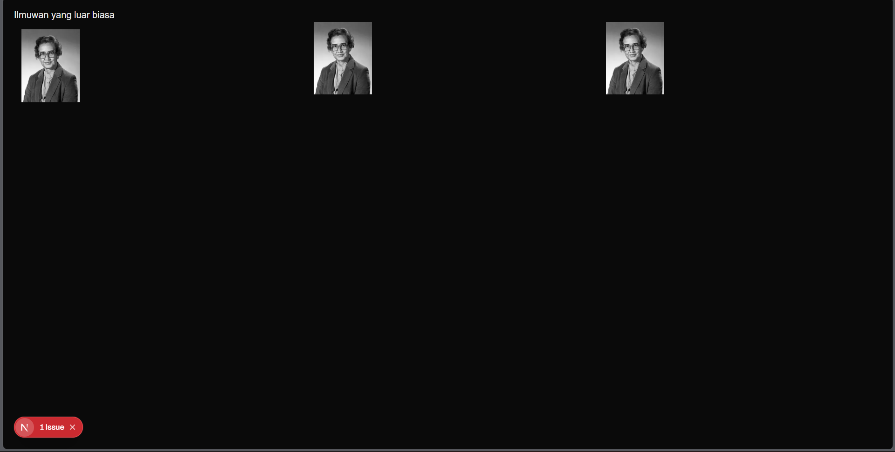
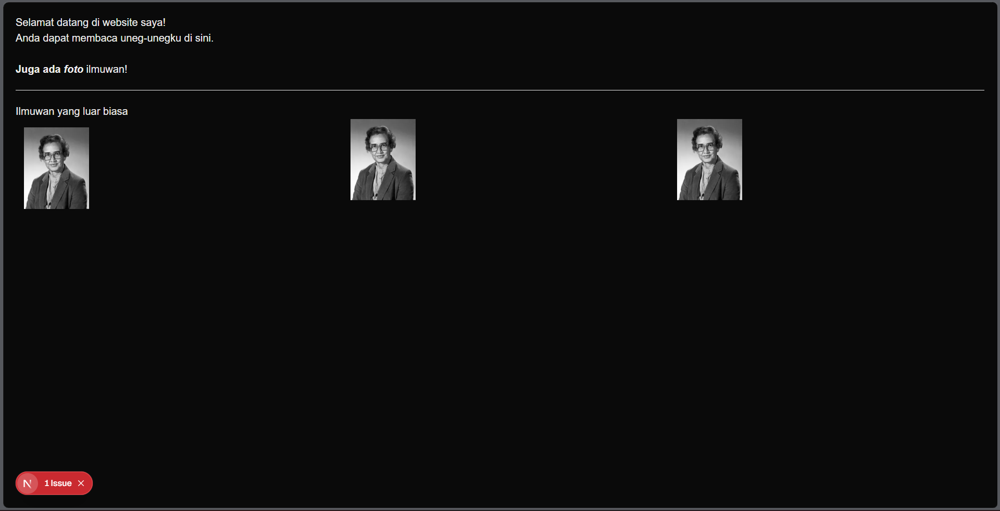
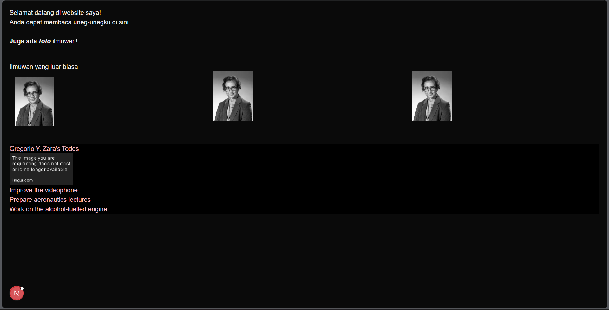
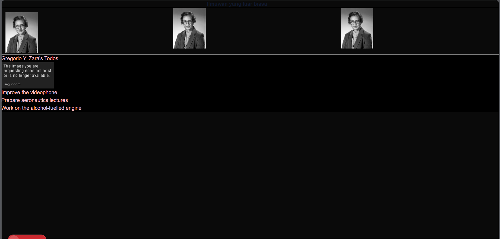
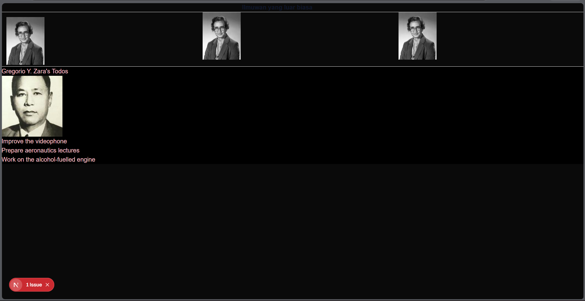

# Laporan Praktikum - Belajar Komponen

## Soal 1

**Apa yang telah saya pelajari:**
Pada langkah ini, saya belajar tentang konsep dasar komponen pada React/Next.js. Saya memisahkan bagian antarmuka menjadi komponen mandiri (membuat file `profile.tsx` di dalam folder `components`), lalu mengimpor dan memanggil komponen tersebut berkali-kali di halaman utama (`page.tsx`). Hal ini membuat kode menjadi lebih rapi dan dapat digunakan ulang (*reusable*).

**Bagaimana cara menyelesaikan error gambar:**
Saat pertama kali dijalankan, muncul error `Invalid src prop` karena Next.js secara ketat membatasi pemuatan gambar dari sumber eksternal demi alasan keamanan dan optimasi. 
Untuk mengatasinya, saya mengedit file `next.config.ts` dan mendaftarkan domain penyedia gambar tersebut ke dalam daftar yang diizinkan (allowlist). Saya menambahkan konfigurasi `remotePatterns` dan memasukkan hostname `i.imgur.com`. Setelah server di-*restart*, gambar berhasil dimuat.

## Soal 2

**Apa yang telah saya pelajari:**
Pada praktikum ini, saya belajar melakukan *refactoring* komponen. Saya membuat komponen `Gallery` yang memuat tiga komponen `Profile`, lalu memanggil `<Gallery />` di `page.tsx`. Ini membuat struktur kode di halaman utama menjadi jauh lebih bersih. Saya juga belajar tentang *Named Export*, sehingga pemanggilannya menggunakan kurung kurawal `{ Gallery }`.

**Bagaimana tampilannya saat ini:**
Karena komponen `Gallery` dibungkus dengan `
`, ketiga foto tersebut kini terbagi rata ke dalam tiga kolom yang mengisi ruang layar.

---

## Soal 3

**Apa yang telah saya pelajari & Mengapa error terjadi:**
Error pada kode awal terjadi karena melanggar aturan ketat JSX:
1. **Multiple Root Elements:** JSX harus mengembalikan satu elemen tunggal. Solusinya, saya membungkus elemen menggunakan *Fragment* kosong `<> ... </>`.
2. **Atribut tidak camelCase:** Atribut `class` bentrok dengan keyword JavaScript. Saya mengubahnya menjadi `className`.
3. **Tag tidak ditutup sempurna:** Tag ` ` saya perbaiki menjadi ` `, dan susunan tag bersarang yang tumpang tindih `<b><i>...</b></i>` diperbaiki menjadi `<b><i>...</i></b>`.

---

## Soal 4

**Apa yang telah saya pelajari & Mengapa error terjadi:**
Error terjadi karena kode asli mencoba merender objek `person` secara utuh ke layar (`{person}'s Todos`), yang mana tidak diizinkan di React. 
Saya memperbaikinya dengan memanggil properti spesifik dari objek tersebut, yaitu `{person.name}`. Saya juga belajar menerapkan *styling* dinamis dengan atribut `style={person.theme}`.

---

## Soal 5

**Apakah ada perbedaan pada tampilan web saat ini?**
Secara visual tidak ada perbedaan tampilan (gambar tetap menunjukkan indikator *link* mati dari Imgur). 

**Apa yang telah saya pelajari:**
Meskipun tampilan tidak berubah, saya belajar memisahkan data (*hardcoded*) dari elemen UI. Saya mengekstrak URL gambar ke dalam objek `person` sebagai `imageUrl`, lalu memanggilnya secara dinamis menggunakan `{person.imageUrl}`. Ini membuat kode jauh lebih rapi dan siap jika datanya nanti berasal dari *database* atau API.
## Soal 6

**Apa yang telah saya pelajari:**
Pada soal ini, saya belajar cara menggabungkan beberapa variabel menjadi satu *string* di dalam atribut JSX. Kesalahan pada kode awal terjadi karena pemanggilan variabel berada di dalam tanda kutip ganda (`""`), sehingga React membacanya sebagai teks literal. 
Solusinya adalah menggunakan *Template Literals* (backtick `` ` ``) agar variabel dapat disisipkan menggunakan simbol `$`. Kodenya saya perbaiki menjadi: `src={`${baseUrl}${person.imageId}${person.imageSize}.jpg`}`.

**Bagaimana tampilannya saat ini:**
Setelah kode diperbaiki dan variabel `imageSize` diubah menjadi `'b'`, gambar Gregorio Y. Zara berhasil muncul dengan ukuran yang lebih besar! Hal ini membuktikan bahwa penggabungan URL (*string concatenation*) pada JSX berhasil berjalan dengan baik.